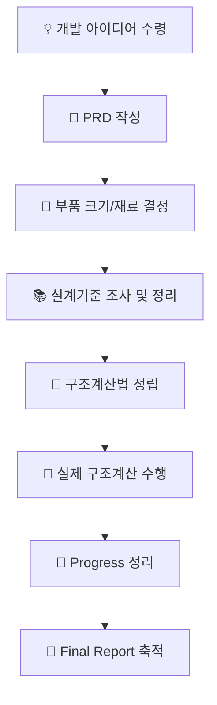

# 🧠 AI 통합 워크플로우 소개 (AI-Integrated Workflow)

## 📌 개요 (What & Why)

전통적인 R&D/Engineering 프로세스는 모든 일을 인간이 처리해야 했음. 일부 궁금한? 사항에 대해서 챗봇chatGPT 등에게 문의하는 정도였음. 새로운 AI 통합 워크플로우는 **반복적이고 기록 위주의 작업을 LLM에 위임** 하도록 하고, 인간은 **엔지니어링 판단과 창의적 결정**에 집중하도록 설계되었음. 

기존에는 모든 단계를 사람이 직접 수행해야 하므로 일관성 있는 업무가 가능하지만, 작업 속도와 리소스 측면에서 한계가 있었음. 따라서, 본 워크플로우는 **AI 통합 사고방식**으로 전환하여 더 빠르고, 정확하며, 협업이 쉬운 문서화 및 엔지니어링을 가능하게 하려고 함.

### 전통적인 프로세스와 달라진, 유의미한 변경사항
- cursor IDE라는 하나의 플랫폼에서 대부분의 AI와의 협업작업이 이루어짐. (자체 cursor panel, Atlassian MCP Server 등 사용) 
- ppt위주의 아웃풋을, markdown 포맷 아웃풋으로 전환됨.
- Confluence 문서를 통해서 인간에게 공유하거나 인간과 협업할 수 있음.

### 인간이 해야할 일 (점차 진화되어 가야하는 부분, 나와 꼭 맞는 협업자를 만들어가는 과정임)
- 템플릿 개선: PRD 템플릿, Progress 템플릿, Final Report 템플릿
- 시스템 인스트럭션(혹은 cursor rules) 개선: PRD 작업지시, Progress 작업지시, Final Report 작업지시
- 작업지시용 프롬프트 엔지니어링
- 맥락 자료(Context) : 현단계의 PRD, Progress, Final Report 자료로 재활용하면됨.

---

## 🧭 전체 흐름 요약 (Overall Workflow)

⚖️ 인간 vs LLM 역할 정리 (Role Division)
| 단계              | 인간이 하는 일           | LLM이 하는 일           |
| --------------- | ------------------ | ------------------- |
| PRD 초안          | 구조와 방향 결정, 핵심요소 입력 | 마크다운 템플릿화, 초안 정리    |
| 부품 설계           | 크기·재료·기능 결정        | 스펙 요약, 테이블 작성, 기록   |
| 설계기준 조사         | 기준 선택, 문서 해석       | 정리 및 citation 포맷 작성 |
| 구조계산법 정립        | 로직/가정 설정, 모델 선정    | 수식 정리, 흐름 재구성       |
| 구조해석 수행         | 수치 계산, 모델 실행       | 결과 정리, 시각화 보조       |
| Progress 정리     | 검토 및 최종 코멘트        | 변경사항 비교, 일일 요약      |
| Final Report 작성 | 핵심 메시지 확정, 최종 편집   | 초안 수집, 과거 정리 자동화    |

🧩 워크플로우 구성 요소 (파일 구조 예시)
📁 Project-X/
├── PRD.md               # 제품 요구사항 정의
├── progress/
│   ├── progress_day1.md # 일별 진행사항 정리 (LLM 보조)
│   ├── progress_day2.md
├── reports/
│   ├── final_report.md  # 최종 보고서 (인간 작성)
│   └── figures/         # 결과 그래프 및 표
├── references/
│   └── design_codes.md  # 적용 설계기준 정리 (LLM 요약)
└── scripts/
    └── calculation.py   # 구조계산 코드 (인간 개발)

### 핵심 장점 요약
- 시간 절약: LLM이 초안/기록/정리 자동화
- 역할 분리: 인간은 판단, AI는 기록
- 워크플로우 확장성: 멀티 프로젝트 병렬 관리 용이
- 협업 효율: 문서 일관성 + 공유 편의성 향상

### 💡 향후 발전 방향
- Progress와 Final Report 자동 연결 자동화 (LLM)
- PRD → 태스크 분할 → Todo 자동화 (OmniFocus, Task Agent 연동)
- 설계 기준 업데이트 자동 감지 (클라우드 기반 LLM + 데이터 크롤러)